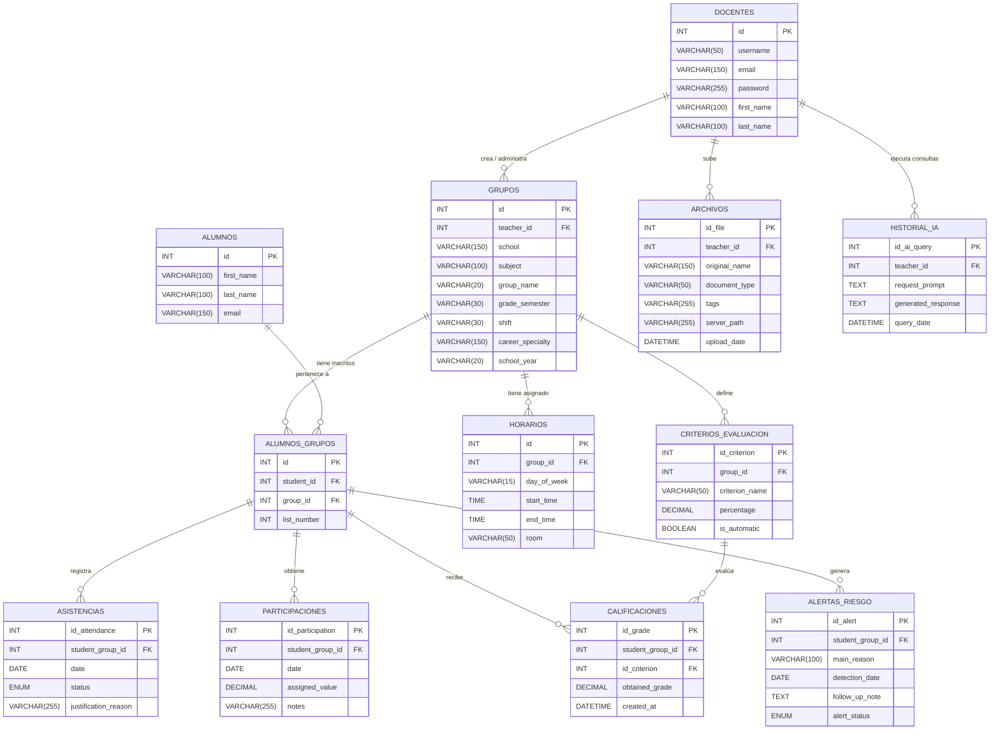

```mermaid
erDiagram
    DOCENTES {
        INT id PK
        VARCHAR(50) username
        VARCHAR(150) email
        VARCHAR(255) password
        VARCHAR(100) first_name
        VARCHAR(100) last_name
    }

    GRUPOS {
        INT id PK
        INT teacher_id FK
        VARCHAR(150) school
        VARCHAR(100) subject
        VARCHAR(20) group_name
        VARCHAR(30) grade_semester
        VARCHAR(30) shift
        VARCHAR(150) career_specialty
        VARCHAR(20) school_year
    }

    ALUMNOS {
        INT id PK
        VARCHAR(100) first_name
        VARCHAR(100) last_name
        VARCHAR(150) email
    }

    ALUMNOS_GRUPOS {
        INT id PK
        INT student_id FK
        INT group_id FK
        INT list_number
    }

    HORARIOS {
        INT id PK
        INT group_id FK
        VARCHAR(15) day_of_week
        TIME start_time
        TIME end_time
        VARCHAR(50) room
    }

    ASISTENCIAS {
        INT id_attendance PK
        INT student_group_id FK
        DATE date
        ENUM status
        VARCHAR(255) justification_reason
    }

    PARTICIPACIONES {
        INT id_participation PK
        INT student_group_id FK
        DATE date
        DECIMAL assigned_value
        VARCHAR(255) notes
    }

    CRITERIOS_EVALUACION {
        INT id_criterion PK
        INT group_id FK
        VARCHAR(50) criterion_name
        DECIMAL percentage
        BOOLEAN is_automatic
    }

    CALIFICACIONES {
        INT id_grade PK
        INT student_group_id FK
        INT id_criterion FK
        DECIMAL obtained_grade
        DATETIME created_at
    }

    ALERTAS_RIESGO {
        INT id_alert PK
        INT student_group_id FK
        VARCHAR(100) main_reason
        DATE detection_date
        TEXT follow_up_note
        ENUM alert_status
    }

    ARCHIVOS {
        INT id_file PK
        INT teacher_id FK
        VARCHAR(150) original_name
        VARCHAR(50) document_type
        VARCHAR(255) tags
        VARCHAR(255) server_path
        DATETIME upload_date
    }

    HISTORIAL_IA {
        INT id_ai_query PK
        INT teacher_id FK
        TEXT request_prompt
        TEXT generated_response
        DATETIME query_date
    }

    %% Relaciones
    DOCENTES ||--o{ GRUPOS : "crea / administra"
    DOCENTES ||--o{ ARCHIVOS : "sube"
    DOCENTES ||--o{ HISTORIAL_IA : "ejecuta consultas"
    
    GRUPOS ||--o{ ALUMNOS_GRUPOS : "tiene inscritos"
    GRUPOS ||--o{ HORARIOS : "tiene asignado"
    GRUPOS ||--o{ CRITERIOS_EVALUACION : "define"
    
    ALUMNOS ||--o{ ALUMNOS_GRUPOS : "pertenece a"
    
    ALUMNOS_GRUPOS ||--o{ ASISTENCIAS : "registra"
    ALUMNOS_GRUPOS ||--o{ PARTICIPACIONES : "obtiene"
    ALUMNOS_GRUPOS ||--o{ CALIFICACIONES : "recibe"
    ALUMNOS_GRUPOS ||--o{ ALERTAS_RIESGO : "genera"
    
    CRITERIOS_EVALUACION ||--o{ CALIFICACIONES : "evalúa"
```